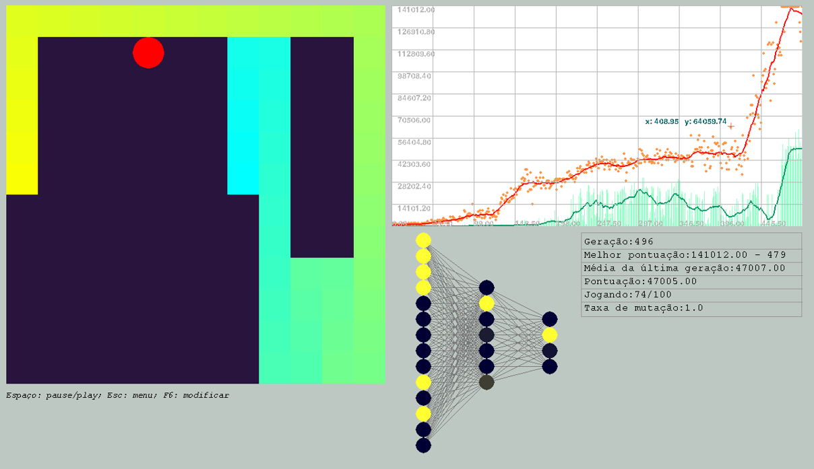

# Snake_AI
Algoritmo genético para selecionar redes neurais que joquem o "Jogo da Cobrinha" (Snake).

- Script "main.py": Interface gráfica para gerenciar os treinamentos.
- Bibliotecas ultilizadas: tkinter, pygame, numpy, random, os, shutil, pickle e pandas.

Interface de treinamento.

Melhor indivíduo encontrado em 490 gerações.
